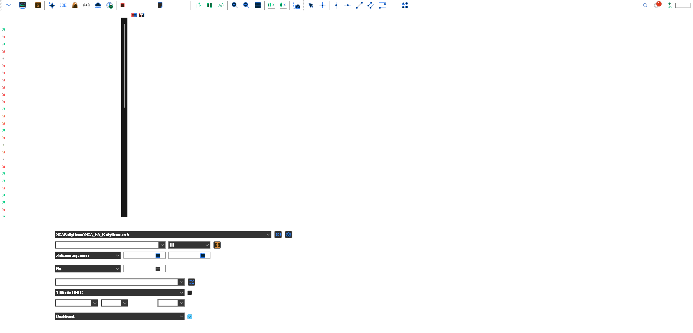

# E149 + M179: owned EA and signal parity proof

This is a deliberately small SMA(3)/SMA(5) example. It is not a customer order, a live-account result, or a profitability claim. The [editable MQL5 EA](../src/parity/SCA_EA_ParityDemo.mq5), [signal include](../src/parity/SCA_EA_ParityDemoSignal.mqh), [read-only fixture harness](../src/parity/SCA_EA_ParityDemoTest.mq5), [Pine v6 indicator](../src/parity/sca_ea_parity_demo.pine), [12-bar OHLC fixture](../src/parity/fixture_ohlc.csv), and [expected signals](../src/parity/expected_signals.csv) are published together.

## Frozen test

Both implementations read completed closes. SMA(3) crossing above SMA(5) yields BULL; crossing below yields BEAR. Warmup bars 0–4 are silent. On the identical 12-bar fixture, the ordered signals are `5:BULL, 8:BEAR`, with no other signal. The MQL5 read-only harness printed `3 passed, 0 failed` in the original MT5 Experts log. The Pine source compiled and ran on an authenticated TradingView OANDA:EURUSD H1 chart; its embedded fixture panel showed `PASS` with the same two events. [Original TradingView chart snapshot](../assets/parity/M179_TradingView_EURUSD_H1_fixture_PASS_20260924.png).

## Actual HolaPrime Strategy Tester run

On 24 September 2026, the EA was compiled with a private portable copy of the installed **HolaPrime MT5** MetaEditor: 0 errors, 0 warnings. An isolated HolaPrime Strategy Tester ran `HolaPrime-Server1` EURUSD H1 from 21 through 24 September 2026, using 1-minute OHLC, 0.01 requested lots, `InpAllowTrading=true`, no optimization or cloud agents. It generated 17,173 ticks and 72 bars and finished normally. Its [original agent-log excerpt](../assets/parity/E149_HolaPrime_tester_log_excerpt_20260924.txt) shows a completed tester SELL on the 02:00 BEAR signal, then an own-position close before a completed tester BUY on the 05:00 BULL signal, with retcode `10009` and position checks. Later opposite signals repeat this sequence. These are simulated tester deals, not real-account orders.

The [tester-generated balance plot](../assets/parity/E149_HolaPrime_tester_balance_20260924.png) is retained as an original run artifact; its balance is not used as a performance claim. The window capture removes only the title and bottom account-status lines, which contained the demo account identifier.

## Limits

The exact Pine/MQL5 parity claim is **only for the shared 12-bar fixture**. TradingView displayed OANDA EURUSD bars, while the EA tester used HolaPrime EURUSD history. Different feeds prevent a candle-by-candle live-chart parity claim. A single-feed cross-platform chart comparison and a genuine 60–90-second run recording are still open for the full B1 proof kit. Still images and this log are original run evidence; no generated illustration is used as proof.

[Need a bounded Pine-to-MT5 conversion with explicit parity cases?](https://stratcorealpha.com/services/pine-script-to-mt5?ref=symb-ws4-github&intent=parity-check)
