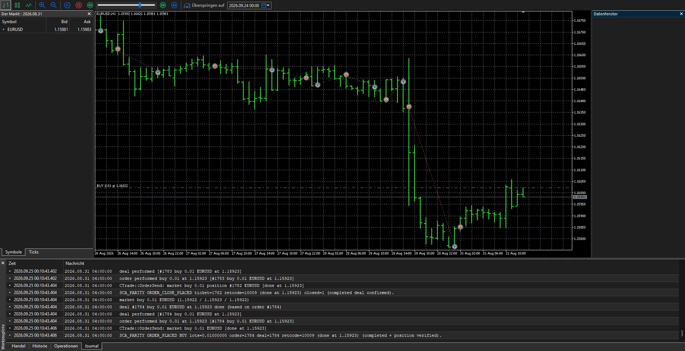
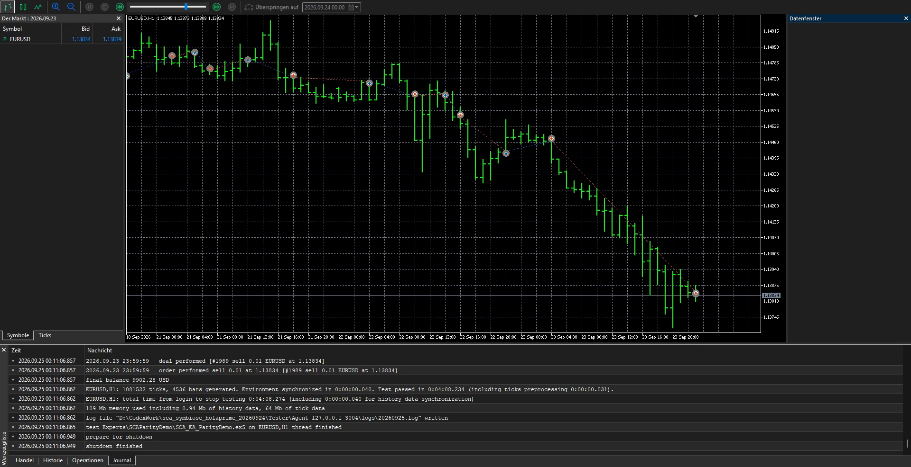

# E149 + M179: owned EA and signal parity proof

This is a deliberately small SMA(3)/SMA(5) example. It is not a customer order, a live-account result, or a profitability claim. The [editable MQL5 EA](../src/parity/SCA_EA_ParityDemo.mq5), [signal include](../src/parity/SCA_EA_ParityDemoSignal.mqh), [read-only fixture harness](../src/parity/SCA_EA_ParityDemoTest.mq5), [Pine v6 indicator](../src/parity/sca_ea_parity_demo.pine), [12-bar OHLC fixture](../src/parity/fixture_ohlc.csv), and [expected signals](../src/parity/expected_signals.csv) are published together.

## Frozen test

Both implementations read completed closes. SMA(3) crossing above SMA(5) yields BULL; crossing below yields BEAR. Warmup bars 0–4 are silent. On the identical 12-bar fixture, the ordered signals are `5:BULL, 8:BEAR`, with no other signal. The MQL5 read-only harness printed `3 passed, 0 failed` in the original MT5 Experts log. The Pine source compiled and ran on an authenticated TradingView OANDA:EURUSD H1 chart; its embedded fixture panel showed `PASS` with the same two events. [Original TradingView chart snapshot](../assets/parity/M179_TradingView_EURUSD_H1_fixture_PASS_20260924.png).

## Actual HolaPrime Strategy Tester run

On 24 September 2026, the EA was compiled with a private portable copy of the installed **HolaPrime MT5** MetaEditor: 0 errors, 0 warnings. An isolated HolaPrime Strategy Tester ran `HolaPrime-Server1` EURUSD H1 from 21 through 24 September 2026, using 1-minute OHLC, 0.01 requested lots, `InpAllowTrading=true`, no optimization or cloud agents. It generated 17,173 ticks and 72 bars and finished normally. Its [original agent-log excerpt](../assets/parity/E149_HolaPrime_tester_log_excerpt_20260924.txt) shows a completed tester SELL on the 02:00 BEAR signal, then an own-position close before a completed tester BUY on the 05:00 BULL signal, with retcode `10009` and position checks. Later opposite signals repeat this sequence. These are simulated tester deals, not real-account orders.

The [tester-generated balance plot](../assets/parity/E149_HolaPrime_tester_balance_20260924.png) is retained as an original run artifact; its balance is not used as a performance claim. The window capture removes only the title and bottom account-status lines, which contained the demo account identifier.

## 68-second original visualizer recording

The same compiled EA source and input settings were run again on 25 September 2026 in the isolated **HolaPrime** visualizer, EURUSD H1 from 1 January to 24 September 2026, 1-minute OHLC. [Watch the 68-second direct screen recording](../assets/parity/E149_HolaPrime_visualizer_run_68s_20260925.mp4): historic bars move, tester trade markers appear, and the live Journal shows completed simulated orders and the test finishing. It is normal-speed original window capture at 8 fps, without added or replaced frames. Video SHA-256: `660DA93B4CA9315DFCDE982C8E1EED7AB986655CBC2E302F3AD861FD987FA782`.

The [original agent-log excerpt](../assets/parity/E149_HolaPrime_visualizer_log_excerpt_20260925.txt) matches the pictured 31 August BULL close-before-BUY and the final 23 September BULL close-before-BUY, both with retcode `10009`. The test completed with 1,081,522 generated ticks and 4,536 bars in 4:08. These are simulated deals only; the account balance and outcome are not performance claims.

## M179: observed cross-platform signal data

The [M179 data kit](../assets/parity/m179/README.md) compares one real
TradingView OANDA:EURUSD H1 Pine chart with one real HolaPrime MT5 EURUSD H1
script run on the same 2026-09-08–09 UTC window. It includes original screenshots
from both platforms, each platform's 48 observed H1 OHLC bars and 16 signal
rows, the read-only MQL5 exporter and Experts-log excerpt, and a reproducible
Python comparison. HolaPrime chart timestamps are UTC+3 in this run and are
converted to UTC before matching bars. The [overlay](../assets/parity/m179/M179_signal_overlay.png)
and [48-bar agreement table](../assets/parity/m179/M179_signal_agreement.csv)
show 16/16 corresponding BULL/BEAR markers and **zero signal mismatches**.
The [discrepancy table](../assets/parity/m179/M179_signal_discrepancies.csv)
is header-only because none occurred. Broker OHLC values differ slightly;
the maximum absolute close gap here is 0.00023. The TradingView CSV was read
from the authenticated chart's visible Table view because native file Download
prompted for a paid plan. No plan was purchased.

## Limits

The fixture establishes exact rule parity on identical 12-bar inputs. The
two-day market comparison establishes observed marker agreement for this
symbol, timeframe, and window after the measured broker-time conversion.
It does not establish feed equality or parity for other periods and rules.
M179 requires no video under the 25 September owner revision. E149's genuine
68-second recording is separate. All proof stills come from actual platform
runs; the Python overlay is an explanatory visualization, not a run screenshot.

[Need a bounded Pine-to-MT5 conversion with explicit parity cases?](https://stratcorealpha.com/services/pine-script-to-mt5?ref=symb-ws4-github&intent=parity-check)
