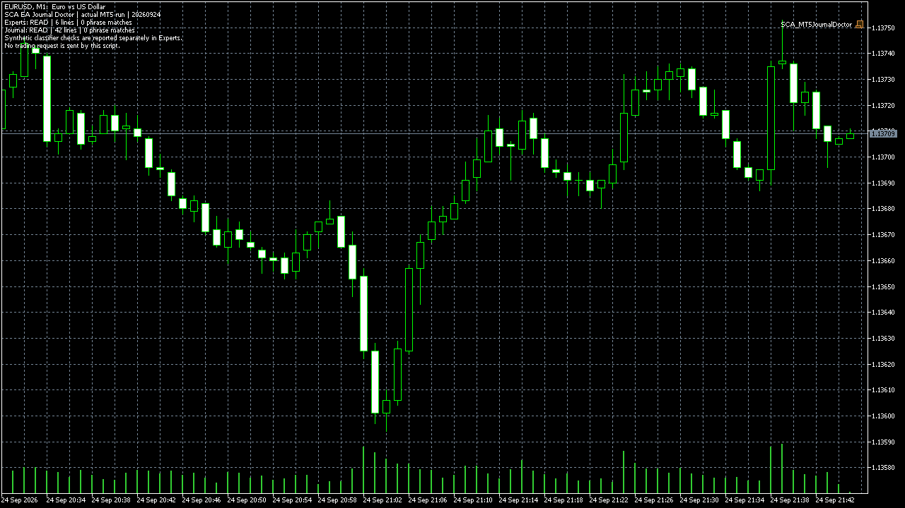

# MT5 EA Journal Doctor

This free, read-only MQL5 script groups common error phrases in copies of the
current day's **Experts** and **Journal** logs. It reports a next check for each
matched category. It sends no order, uses no DLL or network call, and keeps raw
log lines out of the saved report.

## Install and run

1. Download [`SCA_MT5JournalDoctor.mq5`](../src/SCA_MT5JournalDoctor.mq5) into
   your MT5 data folder under `MQL5/Scripts` and compile it with that terminal's
   MetaEditor.
2. In MT5, use **File → Open Data Folder**. Copy today's
   `MQL5/Logs/YYYYMMDD.log` and `Logs/YYYYMMDD.log` into
   `Terminal/Common/Files/JournalDoctor` as `Experts-YYYYMMDD.log` and
   `Journal-YYYYMMDD.log`. Keep both original files in place. The script cannot
   read the original log directories directly because of the MQL5 file sandbox.
3. Run the script on any chart. Leave the date input blank for the computer's
   local date, or enter `YYYYMMDD`. The script reads at most 20,000 lines from
   each copy and marks a limit hit as `TRUNCATED`.
4. Read `Terminal/Common/Files/SCA_JournalDoctor_YYYYMMDD.txt` and the
   prefixed lines in **Experts**. A missing copy is `MISSING`, never zero errors.
   The optional chart screenshot is saved in this terminal's `MQL5/Files`.

The categories are invalid stops, not enough money, trade context busy, market
closed, AutoTrading disabled, invalid volume, off quotes/no price, and trade
disabled. The matching is phrase-based. Zero matches means that no configured
phrase appeared in the copied part of the logs. Inspect the original private
log around each event before changing code or trading settings.

## Actual runtime evidence

On 24 September 2026, the source was compiled with **Hola Prime MT5 Terminal**
MetaEditor: zero errors and zero warnings. The script ran in that terminal on
EURUSD M1 with live trading disabled in the startup configuration. Its first
run generated an Experts log; the second run read copies of both original
HolaPrime logs. The [saved report](evidence/SCA_JournalDoctor_HolaPrime_runtime_2026-09-24.txt)
shows `Experts: READ | lines read: 6` and `Journal: READ | lines read: 42`,
with no matched error phrases in those copies. The Experts output separately
showed `SYNTHETIC_SELFTEST passed=10 failed=0`; those fixtures are classifier
checks, not broker errors or customer results.

The screenshot above was saved by MT5's `ChartScreenShot` during the actual
second run. Raw terminal logs remain private because they can contain account
and network details. The tool does not diagnose an EA, confirm a trade,
guarantee prop-firm compliance, or imply trading performance.

## Invalid-stops example from a real tester run

On 25 September, a separate tester-only probe was compiled with the isolated
Hola Prime MetaEditor (0 errors, 0 warnings) and run on EURUSD H1 in the
HolaPrime Strategy Tester. It intentionally put a BUY stop loss above the ask.
The [original tester-log excerpt](../assets/probes/InvalidStops_HolaPrime_EURUSD_H1_tester_20260925.txt)
shows `failed market buy ... [Invalid stops]` and `retcode=10016`. The
[probe source](../src/probes/SCA_InvalidStopsTesterProbe.mq5) exits unless it is
inside the Strategy Tester. No live-account order was sent. This is a
reproducible error example, not a customer incident or evidence that the
Journal Doctor repaired an EA. For a BUY, inspect the current Bid, the requested
SL and the symbol's minimum stop distance before changing entry logic.

Need a bounded repair after finding the original error? [Send the exact error,
platform version, authorized source and expected behavior](https://stratcorealpha.com/services/mql5-bug-fix?ref=symb-ws4-github&intent=mt5-repair).

Reference: [MQL5 `FileOpen` sandbox](https://www.mql5.com/en/docs/files/fileopen),
[MT5 startup configuration](https://www.metatrader5.com/en/terminal/help/start_advanced/start),
and [MQL5 `ChartScreenShot`](https://www.mql5.com/en/docs/chart_operations/chartscreenshot).
