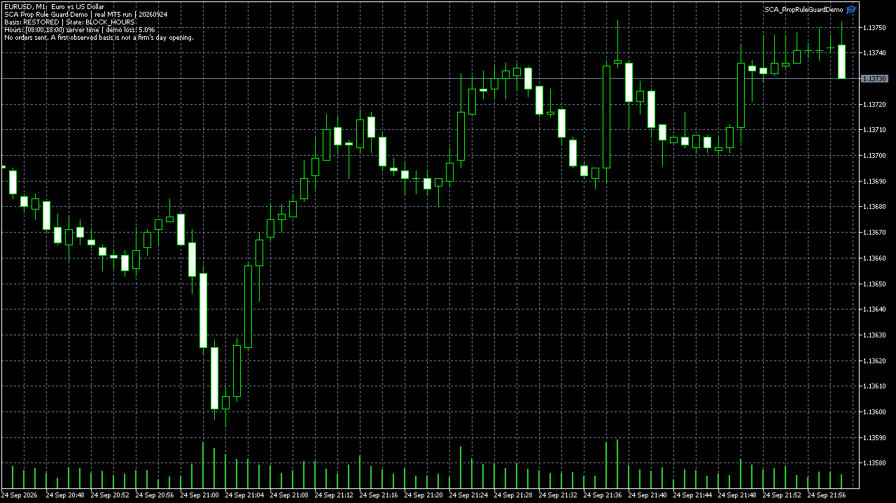

# MT5 Prop Rule Guard demo

This open-source EA is an **observer and demonstration**, not a trading EA. It
checks current account equity against a persisted observed daily basis and a
broker-server-hour window. It prints `ALLOW`, `BLOCK_LOSS` or `BLOCK_HOURS` on a
chart and in Experts. It never sends, changes or cancels an order.

## Rule and restart boundary

Set `InpDailyLossPercent`, `InpStartHour` and `InpEndHour` before testing. The
hours use the broker server's calendar day and interval `[start,end)`. The loss
condition trips when current equity is **at or below** the observed baseline
times `(1 - percentage / 100)`.

The first attach for a server day saves the observed equity in a persistent
terminal global variable keyed to the account and day. Another attach or
terminal restart that day reads that same value and logs `BASIS=RESTORED`.
At the next server date, a new basis is observed. `FIRST_OBSERVED` is not
evidence of the firm's true day-opening equity if the EA first attaches after
the reset. A production implementation must freeze the firm's exact reset
time, equity definition, breach action and restart policy before it can be
connected to order logic in authorized editable source.

## Real HolaPrime MT5 runs

The source compiled with HolaPrime MetaEditor with zero errors and warnings.
The final source completed a real EURUSD M1 Strategy Tester run on 23 September
2026 data: 5,703 ticks, 1,435 bars, `OnTester result 1`, and no trades. The
Experts log shows `BLOCK_HOURS` at 00:00, `ALLOW` at 08:00, and `BLOCK_HOURS`
at 18:00. Six **synthetic** state fixtures passed, including the daily-loss
boundary; the no-trade tester run does not demonstrate a real equity loss.

Two separate starts of the actual HolaPrime demo terminal on 24 September
showed `BASIS=FIRST_OBSERVED` and then `BASIS=RESTORED` for the same day. The
[selected original log lines](evidence/SCA_PropRuleGuardDemo_HolaPrime_runtime_2026-09-24.txt)
show the run times and state transitions. The [MT5 chart screenshot](../assets/sca-prop-rule-guard-holaprime-restart-2026-09-24.png)
was saved by the EA during the second start. Raw terminal logs remain private.

The [12-second original screen recording](../assets/sca-prop-rule-guard-holaprime-tester-raw-2026-09-24.mp4)
shows the real HolaPrime visual tester running. The [72-second viewing copy](../assets/sca-prop-rule-guard-holaprime-tester-72s-2026-09-24.mp4)
contains the same recorded frames played six times slower. Its longer duration
does not represent a longer test. The tester ran on historical EURUSD data;
neither recording is a profit, safety or challenge-passing claim.

Need a rule added to your authorized existing EA? [Send the exact firm rule,
reset clock, editable source and three acceptance cases](https://stratcorealpha.com/services/mql5-bug-fix?ref=symb-ws3-github&intent=mt5-repair).
