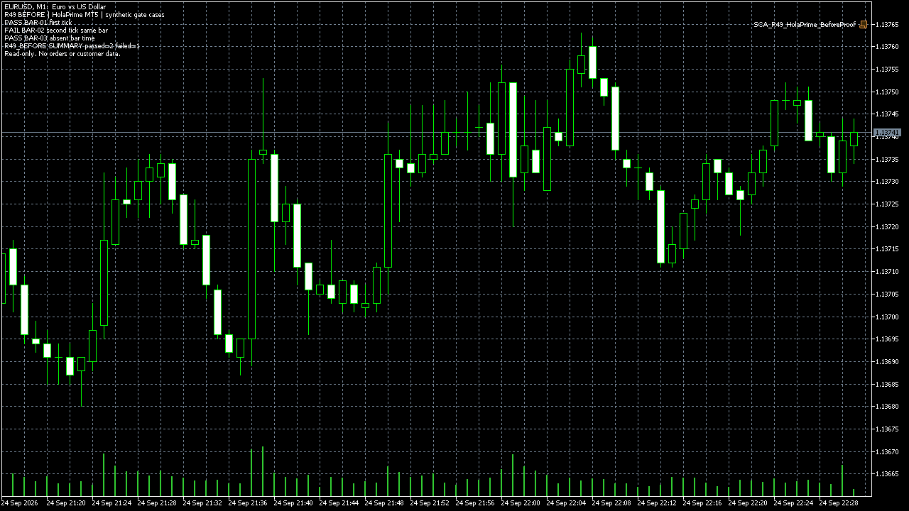
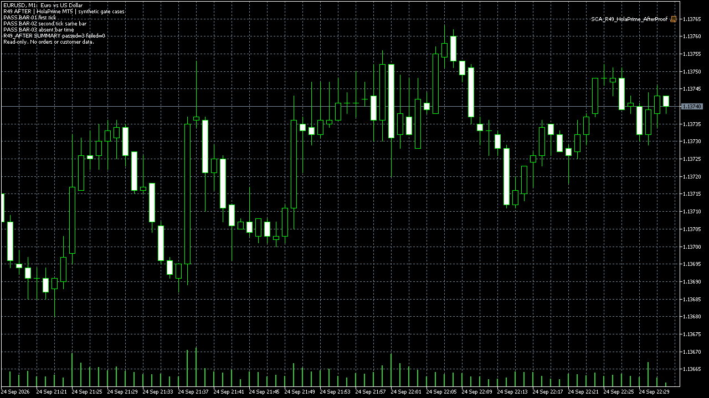

# R49 duplicate-bar repair: actual HolaPrime MT5 run

This is an owned, intentionally defective example followed by one bounded repair. It is not a customer case, an order-execution test, or a trading-performance result.

| Acceptance case | Before | After |
|---|---|---|
| BAR-01: accept the first tick of a valid bar | PASS | PASS |
| BAR-02: reject the next tick of the same bar | FAIL | PASS |
| BAR-03: reject a missing bar timestamp | PASS | PASS |

The before gate stores the last bar but does not compare it with the next bar. The after gate adds that comparison. The [before](../src/r49/SCA_R49_Before.mq5) and [after](../src/r49/SCA_R49_After.mq5) read-only EAs use the same respective gate includes as the [before proof script](../src/r49/SCA_R49_HolaPrime_BeforeProof.mq5) and [after proof script](../src/r49/SCA_R49_HolaPrime_AfterProof.mq5).

On 24 September 2026, both proof scripts compiled in **HolaPrime MetaEditor 5 with 0 errors and 0 warnings**. They ran in the **HolaPrime MT5** installation on EURUSD M1 with live trading and DLL imports disabled. The [actual Experts log excerpt](evidence/HolaPrime_Runtime_20260924.txt) records 2/3 before and 3/3 after.

[Watch the 64-second actual terminal recording](../assets/R49_HolaPrime_before_after_64s.mp4). It joins 32 seconds of the before run and 32 seconds of the after run at normal speed. Only the window title bar containing the demo-account identifier was cropped; no result or chart data was replaced. Video SHA-256: `672267DE10291FE6AB255F3BD9851FEA3EF1218F8CE434D98D62F6186516F80F`.

The three cases exercise the isolated bar gate. They do not demonstrate trades, a full EA Strategy Tester run, live broker equivalence, a customer delivery, or returns.

[Need a reproducible EA defect fixed?](https://stratcorealpha.com/services/mql5-bug-fix?ref=symb-ws2-github&intent=mt5-repair)
