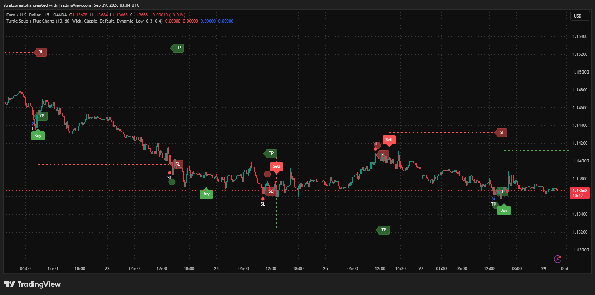
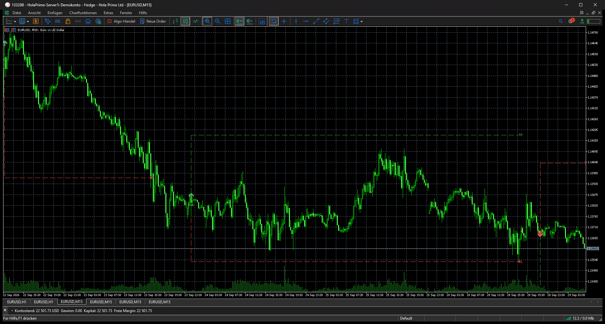

# ICT Turtle Soup on EURUSD M15: original and MT5 port

Unedited application captures from 2026-09-29 show the overlapping 22–29 September 2026 window with the default 10-bar MSS swing, 60-minute range, Wick breakout, Classic entry and Dynamic TP/SL settings. The TradingView original uses OANDA candles. The MT5 v1.02 port uses a HolaPrime demo account. The backtest dashboards were disabled for this visual comparison.

| TradingView: Flux Charts original, OANDA | MetaTrader 5: v1.02 port, HolaPrime |
| --- | --- |
|  |  |

Both applications visibly draw sweep and entry markers and TP/SL levels. This comparison demonstrates live rendering after correcting the MT5 history-window gate. It is not a signal-timestamp, level-price or performance parity result: OANDA and HolaPrime candles and timezones differ, and the two screenshots were captured at different moments. [README.md](README.md) lists the known rendering and closed-bar differences. A numeric acceptance check needs timestamp-normalized, paired candles and exported buffers.
