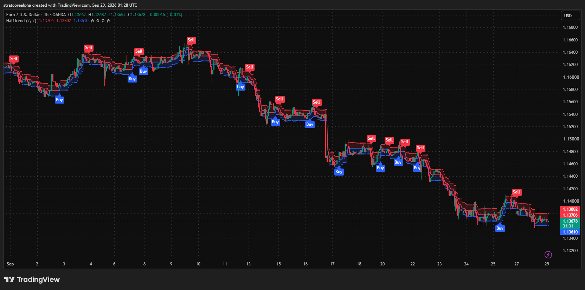
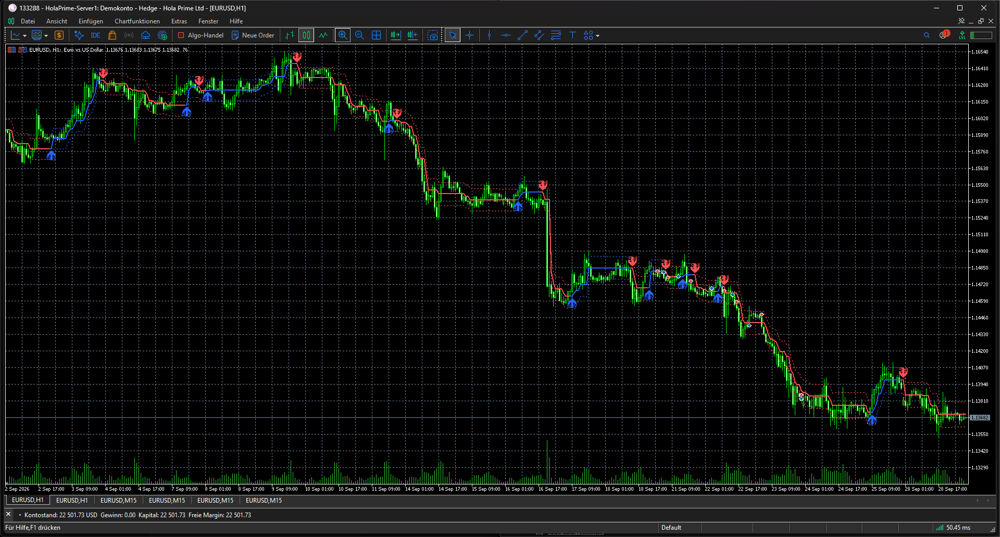

# HalfTrend on EURUSD H1: original and MT5 port

These are unaltered screenshots from the actual applications on 2026-09-29. Both show EURUSD H1 and the overlapping September 2026 window, with amplitude 2 and channel deviation 2. The TradingView image uses OANDA; the MT5 image uses the HolaPrime demo feed. The captures were taken at different times, so the current bars are not a paired observation.

| TradingView: everget original, OANDA | MetaTrader 5: v1.01 port, HolaPrime |
| --- | --- |
|  |  |

The MT5 image shows the line, channel and Buy/Sell markers after the v1.01 time-series fix. The MT5 channel fill was disabled for readability; it does not change the indicator buffers. The screenshots establish visible output on both applications. They do not establish signal-time or numeric parity across different feeds. A closed-bar value comparison requires matching timestamps and the source-feed candles, as described in [README.md](README.md).
