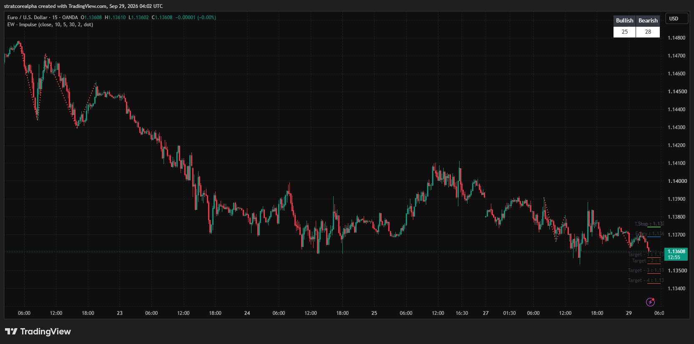
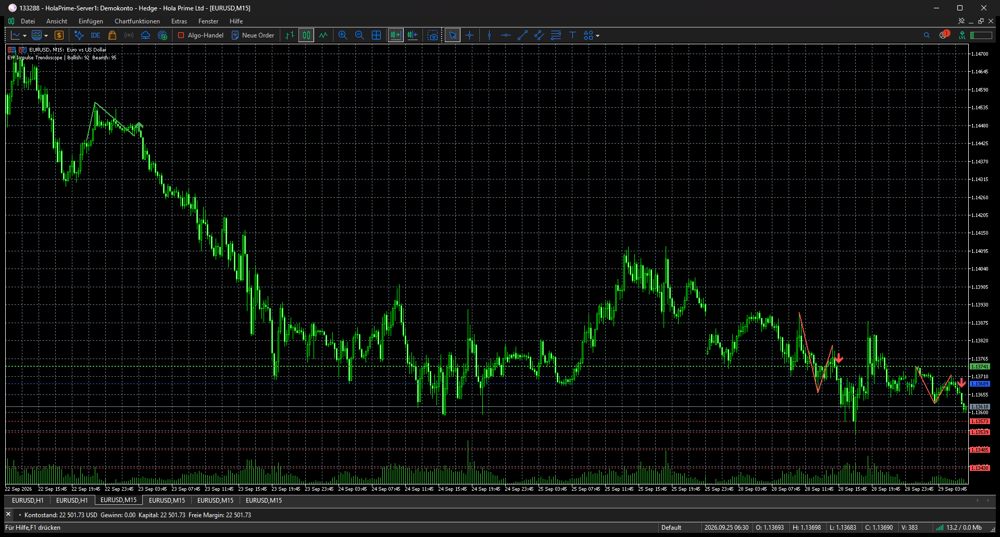

# Elliot Wave - Impulse on EURUSD M15: original and MT5 port

Unedited application captures from 2026-09-29 show the overlapping 22–29 September 2026 window with zigzag length 10, tolerance 5% and entry offset 30%. The TradingView original uses OANDA candles. The MT5 v1.01 port uses a HolaPrime demo account.

| TradingView: Trendoscope original, OANDA | MetaTrader 5: v1.01 port, HolaPrime |
| --- | --- |
|  |  |

The original displays its wave/level labels near the most recent signal. The MT5 port draws wave legs, arrow markers and latest level lines. The headline counts (TradingView 25 bullish/28 bearish; MT5 92 bullish/95 bearish) are **not comparable**: each app loaded a different amount of chart history, in addition to different feeds. This is a visual port demonstration, not event-by-event parity or a performance claim. The rendering and closed-bar differences are listed in [README.md](README.md). A numeric comparison requires a bounded common window, timestamp-normalized candles and level exports.
