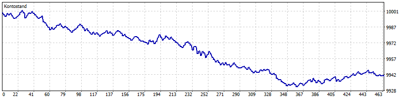

# Getestet #3: fixed morning breakout on MT5 server time

This is one historical test of a written EURUSD M15 rule in the isolated
HolaPrime MT5 Strategy Tester. I froze the rule before the run and included the
exact tester-only EA source, original report, chart and event exports.

The rule uses four completed bars from 10:00 to 10:45 **server time** for the
range. It can enter after a completed close outside that range from 11:00 until
14:00, at most once per server day. The stop sits at the opposite range edge,
the target is one stop distance away, and an open position exits at the first
modelled tick at or after 19:00. The EA uses a fixed 0.01 lot and refuses to
run outside the Strategy Tester.

## Observed run

| Setting or result | One recorded run |
| --- | ---: |
| Symbol and timeframe | EURUSD M15 |
| Server-time window | 2025-09-01 to 2026-09-01 |
| Tester model | One-minute OHLC generated ticks (Model=1) |
| Starting balance | USD 10,000 |
| Completed trades | 231 |
| Net result | **-USD 59.26** (-0.59%) |
| Final balance | USD 9,940.74 |
| Maximum equity drawdown | USD 71.12 (0.71%) |
| Prop-rule verdict | Inconclusive; no full firm rule set was applied |

## Inspect the evidence

- [Frozen v1.2 rule](RULES_london_breakout_v1.2.md) and its
  [machine-readable settings](RULES_london_breakout_v1.2.json)
- [Exact tester-only EA source](SCA_Getestet2_LondonBreakout_v12.mq5)
- [Bounded run report](report_native_12m_v12.md) and
  [original MT5 tester report](native-v12/g2_lb12_12m_eurusd_m15.htm)
- [Tester configuration](native-v12/g2_lb12_tester.ini),
  [compile log](native-v12/g2_lb12_compile.log) and
  [run metadata](native-v12/g2_lb12_run.json)
- [Original deal](native-v12/g2_lb12_deals.csv) and
  [event](native-v12/g2_lb12_events.csv) exports
- [Native evidence hashes and coverage](run_manifest_native_v12.json)

The 65 MB per-tick equity export and full broker-bar export remain in the
local run archive; their byte counts and SHA-256 hashes are in the manifest.
The manifest and original report retain their local source paths as provenance.
The adjacent files here are selected copies of the native evidence.

The fixed server-time grid is **not proven to match London wall time** across
this year. Generated ticks model intrabar fills; they are not observed market
ticks. This single losing run does not establish a general strategy result,
future return, or prop-firm pass or fail.
